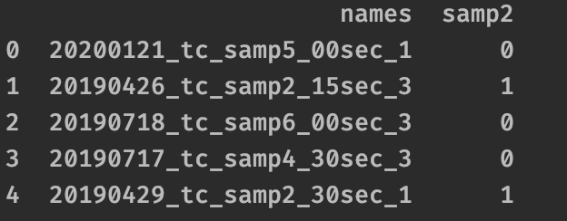

=====================
Create a start object
=====================

Create an object that lrengine populates with attributes according to the arguments,

.. code-block:: python

    lrobject = lr.start(path, patterns=["samp2"])

The **start** **object** now contains a **.frame** that is a Pandas DataFrame of classifiers pulled from the file or sub-directory names using **patterns=**,

    Head of **.frame** created by lrengine
