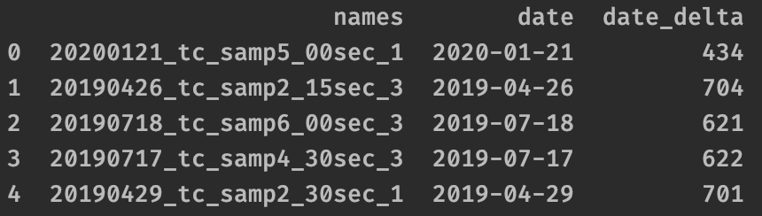

==================================
Find dates in file or folder names
==================================

lrengine can find dates of a specified format, or search for dates of any common format. 

.. code-block:: python

    lrobject.find_dates(format="YYYYMMDD")

    **.head()** with dates added

Use **date_format="any"** to try all supported date formats. If more than one date is found the date and date_delta will be lists. The date formats that are found are also given as a new column. Only logical dates (i.e. past or present only) and dates on or after 1900-01-01 are considered,

.. code-block:: python

    lrobject.find_dates(format="any")

.. figure:: _static/images/listed_dates.png
    :width: 600
    :align: center

    **.head()** after setting **date_format="any"**

The currently supported date_format options are,

* "YYYYMMDD"
* "YYYYDDMM"
* "MMDDYYYY"
* "DDMMYYYY"
* "YYMMDD"
* "YYDDMM"
* "MMDDYY"
* "DDMMYY"
* "YYYY-MM-DD" ("-" implies "-", "_", or "/")
* "YYYY-DD-MM"
* "MM-DD-YYYY"
* "DD-MM-YYYY"
* "YY-MM-DD"
* "YY-DD-MM"
* "MM-DD-YY"
* "DD-MM-YY"