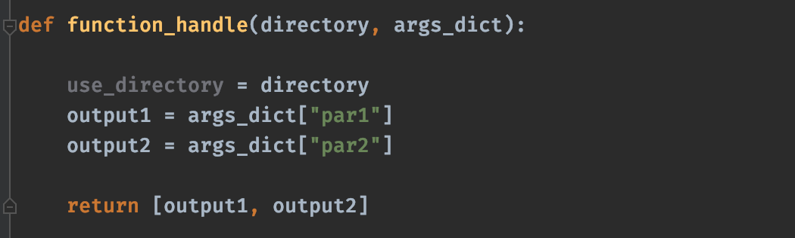
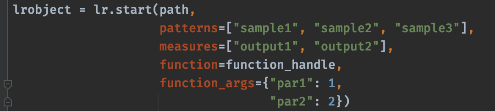
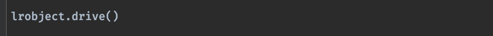
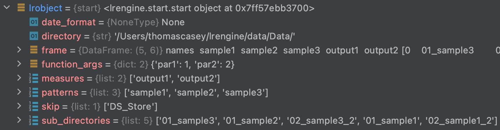
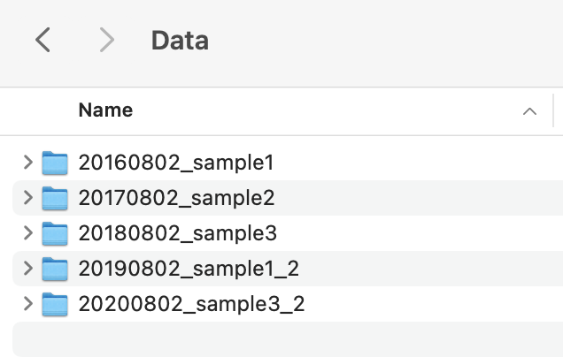
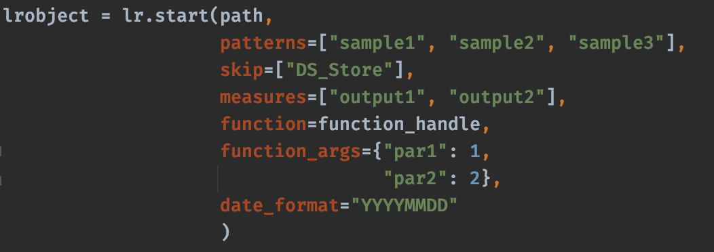
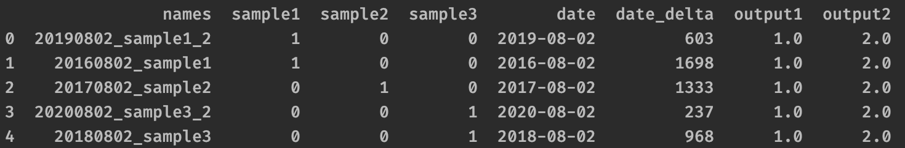
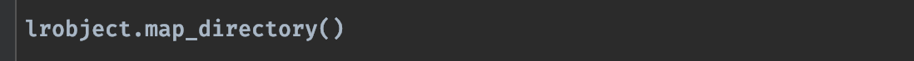

========================
Introduction to lrengine
========================

The aim of lrengine is to provide a simple mechanism for building and interacting with a DataFrame that has 'classifiers' that are extracted from file and/or folder names. Users can define a function that operates on those files and/or folders and define additional 'classifiers' that are the outputs returned from the function. This provides an easy way to interact with directories of common data types and search for correlations between the file and/or folder names and outputs of the function's operations on those files and/or folders.

How to use lrengine
===================

Imagine a directory of data folders having in them a common type of data,

.. figure:: _static/images/dir.png
    :width: 400
    :alt: lrengine concept
    :align: center

    Example parent directory

Define a function that operates on the files or sub-directories of the parent directory and returns a list of observables,

    Example function

Create an object that contains the parent directory's file and sub-directory names, a function handle, and the identities of **measures=** output from the function,

    Example `start` object creation

Use the **drive()** method to apply the function to each file or sub-directory of the parent directory,

    Call to `drive()` method

The **start** **object** now contains a **.frame** that is a Pandas DataFrame of classifiers pulled from the file or sub-directory names using **patterns=** and also those returned from the function,

.. figure:: _static/images/df_head.png
    :width: 500
    :alt: lrengine concept
    :align: center

    Head of `frame` created by lrengine

    General structure of the `start` object

Skipping names by defining 'skip' patterns
------------------------------------------
Define **skip=** patterns, any names having these patterns in their name will be ignored,

.. figure:: _static/images/example_call_skip.png
    :width: 500
    :alt: lrengine concept
    :align: center

    Added `skip=` argument

Looking for Dates in file or sub-directory names
------------------------------------------------
Add the argument **date_format=** and if dates of this format are found in the names they will be added as a classifier, along with a number of days elapsed since the date, **date_delta**

    Example directory of folders with dates in the names

    Added **date_format=** argument to look for dates

    **frame** now has date and date_delta classifiers

Map the parent directory
------------------------
Use the **map_directory()** method to add **directory_map** to the **start** object. This is a dictionary with keys that are the directories, values are lists of filenames in the directory,

    Call the **map_directory()** method

.. figure:: _static/images/dir_map.png
    :width: 500
    :alt: lrengine concept
    :align: center

    directory_map

