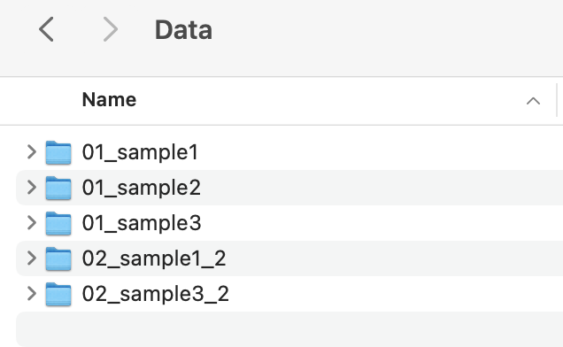

========================
Introduction to lrengine
========================

The aim of lrengine is to provide a simple mechanism for building and interacting with a DataFrame that has 'classifiers' that are extracted from file and/or folder names. Users can also define a function that operates on those files and/or folders and returns additional 'classifiers'. This provides an easy way to interact with directories of common data types and search for correlations between text in the file and/or folder names and any outputs of a user-defined function's operations on those files and/or folders. See the examples for a template script.

How to use lrengine
===================

Imagine the directory,

    Example parent directory

Import the lrengine package,

.. code-block:: python

    import lrengine as lr

Create an object that classifies the members of the directory using patterns in the names,

.. code-block:: python

    lrobject = lr.start(path, patterns=["example"])

.. figure:: _static/images/df_example_head.png
    :width: 300
    :align: center

    Head of **.frame** created by lrengine

If the members of the directory are a common type, define a function that operates on each member and returns classifiers. In this example the classifiers are called "output1" and "output2" but you may use whatever you would like for the names of the classifiers,

.. code-block:: python

    def function_handle(directory, args_dict):

        use_directory = directory
        output1 = random.randint(0, args_dict["par1"])
        output2 = random.randint(args_dict["par1"], args_dict["par2"])

        return [output1, output2]

Add some additional arguments to the start object,

.. code-block:: python

    lrobject = lr.start(path,
                        patterns=["sample1", "sample2", "sample3"],
                        classifiers=["output1", "output2"],
                        function=function_handle,
                        function_args={"par1": 1,
                                       "par2": 2}
                        )

Use the **drive()** method to apply the function to each file or sub-directory of the parent directory,

.. code-block:: python

    lrobject.drive()

The **start** **object** now contains a **.frame** that is a Pandas DataFrame of classifiers pulled from the file or sub-directory names using **patterns=** and also those returned from the user-defined function,

.. figure:: _static/images/df_head.png
    :width: 500
    :align: center

    Head of **.frame** created by lrengine

Skipping names by defining 'skip' patterns
------------------------------------------
Define **skip=** patterns, any files or sub-directories having these patterns in their name will be ignored,

.. code-block:: python

    lrobject = lr.start(path,
                        patterns=["sample1", "sample2", "sample3"],
                        skip=["DS_Store"],
                        classifiers=["output1", "output2"],
                        function=function_handle,
                        function_args={"par1": 1,
                                       "par2": 2}
                        )

Looking for Dates in file or sub-directory names
------------------------------------------------
Add the argument **date_format=** and if dates of this format are found in the file or sub-directory names they will be added as a classifier along with a number of days elapsed, **date_delta**, since the found date,

.. figure:: _static/images/dir_dates.png
    :width: 400
    :align: center

    Example directory of folders with dates in the names

.. code-block:: python

    lrobject = lr.start(path,
                        patterns=["sample1", "sample2", "sample3"],
                        skip=["DS_Store"],
                        classifiers=["output1", "output2"],
                        function=function_handle,
                        function_args={"par1": 1,
                                       "par2": 2}
                        date_format="YYYYMMDD"
                        )

.. figure:: _static/images/df_dates.png
    :width: 700
    :align: center

    **.frame** now has date and date_delta classifiers

