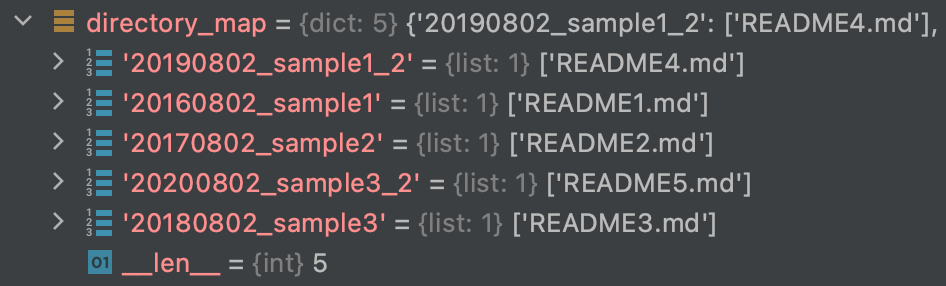

===============
Map a directory
===============

Use the **map_directory()** method to add **.directory_map** to the **start** object. This is a dictionary with keys that are the directories and values that are lists of filenames found in the directories,

.. code-block:: python

    import lrengine as lr

    lrobject.map_directory()

    .directory_map

The **map_directory()** method can also deal with hidden or empty directories, and you may also toggle the **os.walk** topdown option. The available arguments are:

.. code-block:: python

    def map_directory(
                      skip=[],
                      skip_empty=True,
                      skip_hidden=True,
                      only_hidden=False,
                      walk_topdown=True,
                      ):
