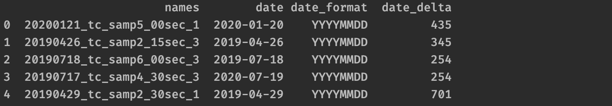

=====================
Reduce the Date Lists
=====================

The **find_dates()** method with the option **date_format='any'** may return lists for each name if more than one date are found. For example, the date 2000-01-01 will be found to be a date as is and also as 00-01-01. To reduce the **'dates'** to a single date format, use the **reduce_dates()** method with the desired format given using the keyword arg **keep=**, 

.. figure:: _static/images/listed_dates.png
    :width: 600
    :align: center

    **.head()** with found dates added

.. code-block:: python

    lrobject.reduce_dates(keep='YYYYMMDD')

    **.head()** after reduction'

You may also keep more than one format by giving a list,

.. code-block:: python

    lrobject.reduce_dates(keep=['YYYYMMDD', 'MMDDYYYY'])

or do the reverse of keep with the keyword arg **remove=**. This, for example,

.. code-block:: python

    lrobject.reduce_dates(remove='YYYYMMDD')

keeps all formats except **'YYYYMMDD'**. You can use lists with remove too. For example,

.. code-block:: python

    lrobject.reduce_dates(remove=['YYYYMMDD', 'MMDDYYYY'])

You may also choose to remove or keep duplicate dates using the keyword arg **only_unique=**. Default is **only_unique=True** for **reduce_dates()**.  For example,

.. code-block:: python

    lrobject.reduce_dates(remove='YYYYMMDD') #removes duplicate dates
    lrobject.reduce_dates()                  #removes duplicate dates
    lrobject.reduce_dates(remove='YYYYMMDD', 
                          only_unique=False) #keeps all dates, even duplicates
    lrobject.reduce_dates(only_unique=False) #keeps frame untouched

There is also an option to keep or remove any elements with 0 for date using the keyword arg **strip_zeros=**. Default is **strip_zeros=False** for **reduce_dates()**.  For example,

.. code-block:: python

    lrobject.reduce_dates(remove='YYYYMMDD') #keeps date=0 elements
    lrobject.reduce_dates(remove='YYYYMMDD', 
                          strip_zeros=True)  #removes date=0 elements

