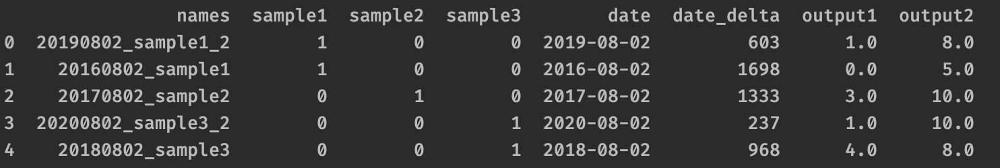
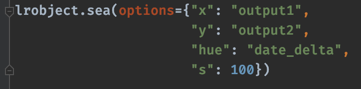
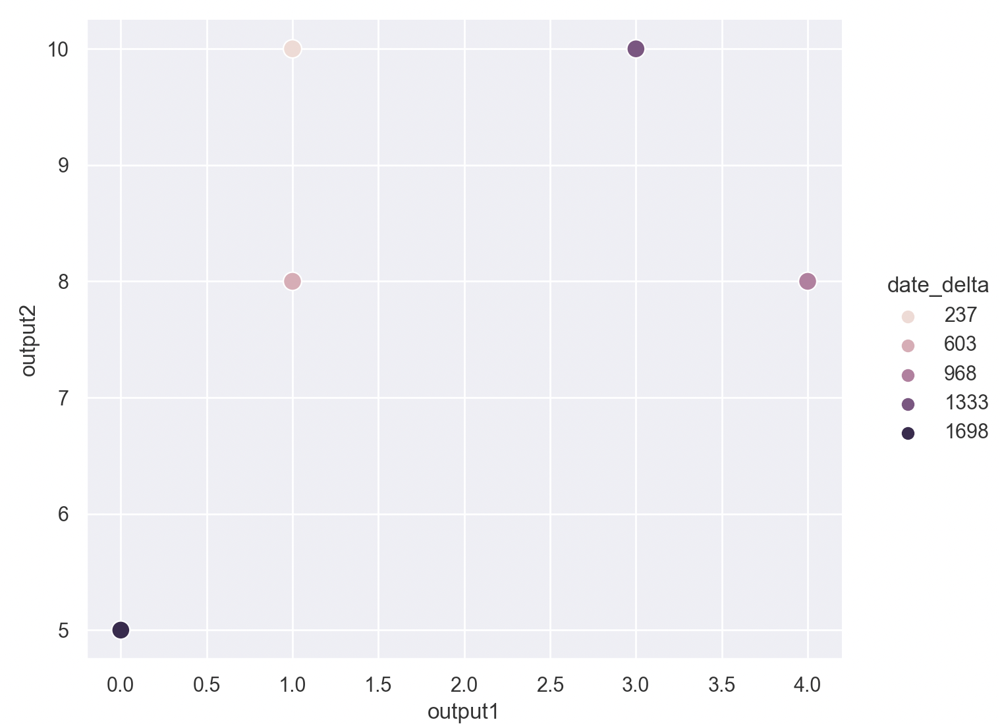

====================================
Make a scatterplot from lrdata.frame
====================================

With the **sea()** method use seaborn to make a scatterplot using the lrobject.frame. Use the same argument names used in **seaborn.scatterplot()** as dictionary keys and pass this dictionary to **sea()**,

    **lrobject.frame**

    Call to **sea()** method

    Scatterplot from seaborn